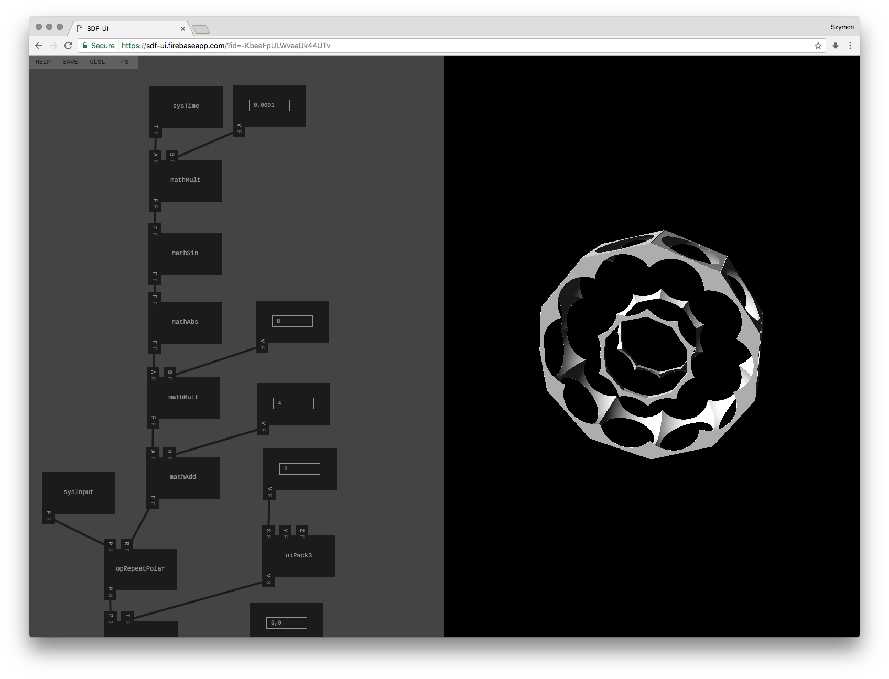

# SDF-UI

## Experimental node-based UI for generating SDF shaders in a browser

Live: [https://sdf-ui.firebaseapp.com](https://sdf-ui.firebaseapp.com)

Made with [react](https://facebook.github.io/react/), [react-gl](https://github.com/gre/gl-react), [redux](https://github.com/reactjs/redux) and [immutable](https://facebook.github.io/immutable-js/).
Most of the code is intentionally left without any optimisations, to be used as starting point for building other graph-based UIs.

## Run

1. clone this repo
2. `yarn` or `npm install`
3. `yarn run start` or `npm start`

## Build

1. `yarn run build` or `npm run build`

## TODO

- [ ] make math operations work on vec3 as well as float - this will require inputs that can accept both floats and vec3s
- [ ] add a way to "unpack" vec3 into three floats, process them, and pack again
- [ ] overwrite connections instead of blocking if there's already one made

